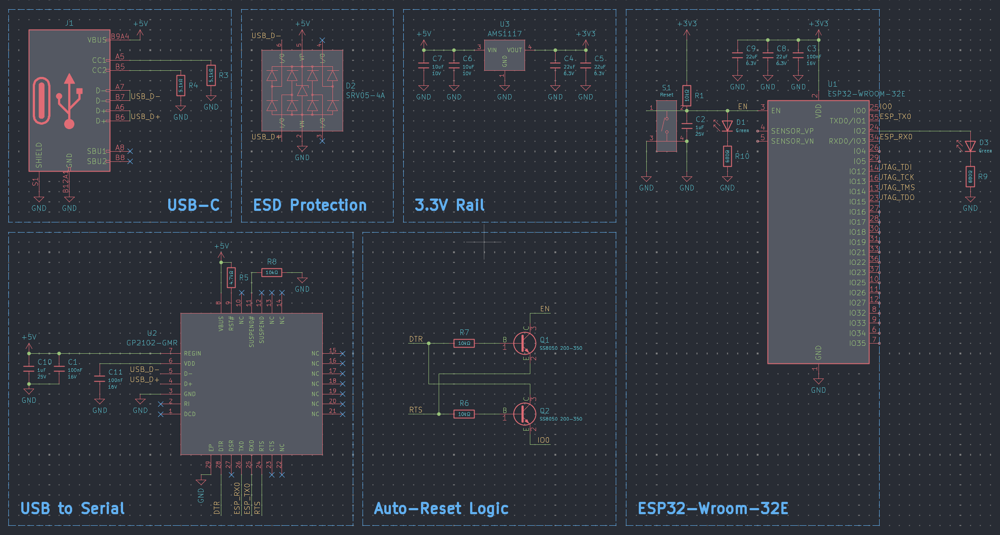

# KiCad-ESP32-Design-Block-Library

I have just started with the ESP32 Wroom but I am planning to add the S2, S3 and C3 in both the module and chip layouts. Requires my [JLCPCB-KiCad-Library](https://github.com/CDFER/JLCPCB-Kicad-Library)

Heads up! this only works with KiCad V9.0+

